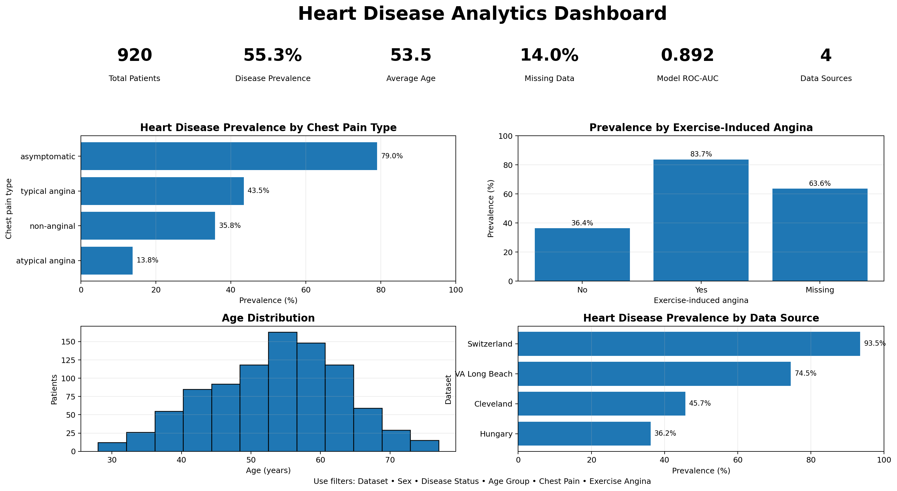

# Heart Disease Analytics

I built this project to answer one focused question:

> **Which clinical features are associated with heart disease, and does a simple predictive model generalize across hospitals?**

The most difficult part was not training the model. It was recognizing that the four data sources have different disease prevalence and missing-data patterns. A model can look strong internally while learning patterns that do not transfer well to a new hospital.

## What I did

- Audited the raw data before analysis
- Preserved the original dataset and created an auditable cleaned copy
- Reclassified implausible cholesterol and blood-pressure zeros as missing values
- Avoided unsupported row deletion
- Performed univariate, bivariate, and multivariate exploration
- Reported effect sizes alongside statistical significance
- Compared a dummy baseline, logistic regression, random forest, and gradient boosting
- Tested generalization by holding out one hospital at a time
- Reduced the dashboard to three decision-focused pages

## Main findings

- Exercise-induced angina and chest-pain type showed strong associations with disease in this sample.
- Patients with disease generally had higher `oldpeak` and lower maximum heart rate.
- Resting blood pressure separated the groups poorly on its own.
- Cholesterol results are difficult to generalize because missingness is strongly linked to data source.
- Logistic regression performed similarly to the more complex models while remaining easier to explain.
- Performance weakened when an entire hospital was excluded from training.

These are **observational associations**, not causal effects.

## Final model

The modeling script generates the current scores rather than relying on manually typed results:

```bash
python src/train_model.py
```

It creates:

- `reports/model_comparison.csv`
- `reports/leave_one_dataset_out.csv`
- `models/modeling_summary.json`
- `models/logistic_regression_pipeline.joblib`

The selected model is intended only as an interpretable portfolio baseline. It is not a clinical decision-support system.

## Dashboard

The dashboard contains three pages:

1. Executive overview
2. Clinical insights
3. Data quality and model validation



The complete dashboard is available in `dashboard/heart_disease_dashboard_3_pages.pdf`.

## Repository structure

```text
heart-disease-portfolio/
├── assets/
│   └── dashboard_preview.png
├── dashboard/
│   ├── 01_executive_overview.png
│   ├── 02_clinical_insights.png
│   ├── 03_quality_and_model.png
│   ├── heart_disease_dashboard_3_pages.pdf
│   ├── dax_measures.txt
│   └── powerbi_theme.json
├── data/
│   ├── raw/heart_disease_uci.csv
│   └── processed/heart_disease_analysis_ready.csv
├── docs/
│   ├── ANALYTICAL_DECISIONS.md
│   ├── DATA_DICTIONARY.md
│   ├── INTERVIEW_NOTES.md
│   └── MODEL_CARD.md
├── models/
│   ├── logistic_regression_pipeline.joblib
│   └── modeling_summary.json
├── reports/
│   ├── analysis_summary.json
│   ├── cleaning_summary.json
│   ├── key_findings.csv
│   ├── model_comparison.csv
│   └── leave_one_dataset_out.csv
├── src/
│   ├── clean_data.py
│   ├── analyze_data.py
│   └── train_model.py
├── run_pipeline.py
├── validate_repository.py
├── requirements.txt
└── README.md
```

## Reproduce the analysis

```bash
git clone <your-repository-url>
cd heart-disease-portfolio
python -m venv .venv
pip install -r requirements.txt
python run_pipeline.py
python validate_repository.py
```

The workflow recreates the processed dataset, analytical summaries, model comparison, transportability results, and final model.

## Key analytical decisions

The reasoning behind the main choices is documented in `docs/ANALYTICAL_DECISIONS.md`. It explains why I did not delete incomplete rows, why I used non-parametric tests, why hospital identity was not used as a predictor, and why logistic regression was selected.

## Limitations

- Retrospective, observational, multi-source dataset
- Hospital-level case-mix and selection bias
- Source-dependent missingness
- Women are underrepresented
- Some clinical variables may already be part of the diagnostic process
- No prospective external validation
- Threshold 0.50 is a transparent baseline, not a clinically optimized threshold

## What I learned

The most important lesson was that a technically strong model can still be unreliable if its performance depends on the hospital that supplied the data. The source-level validation changed how I interpreted the internal scores and prevented me from overstating the model's usefulness.

## Responsible use

This project is for analysis, education, and portfolio demonstration. It must not be used to diagnose patients, select treatment, or communicate individual clinical risk.
